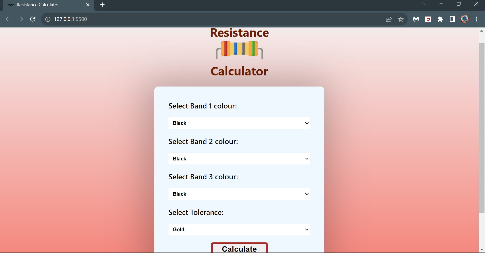
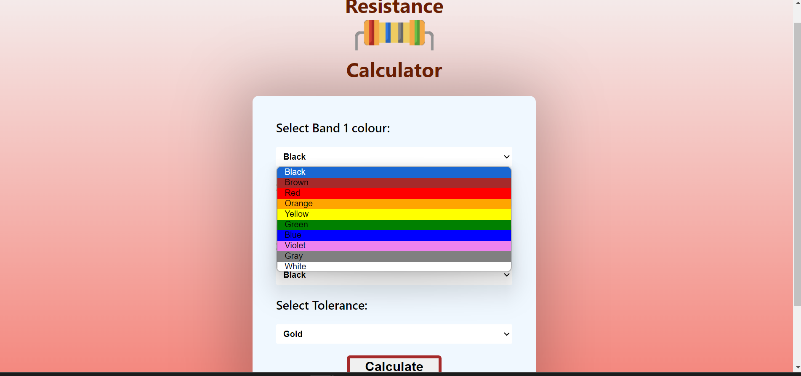
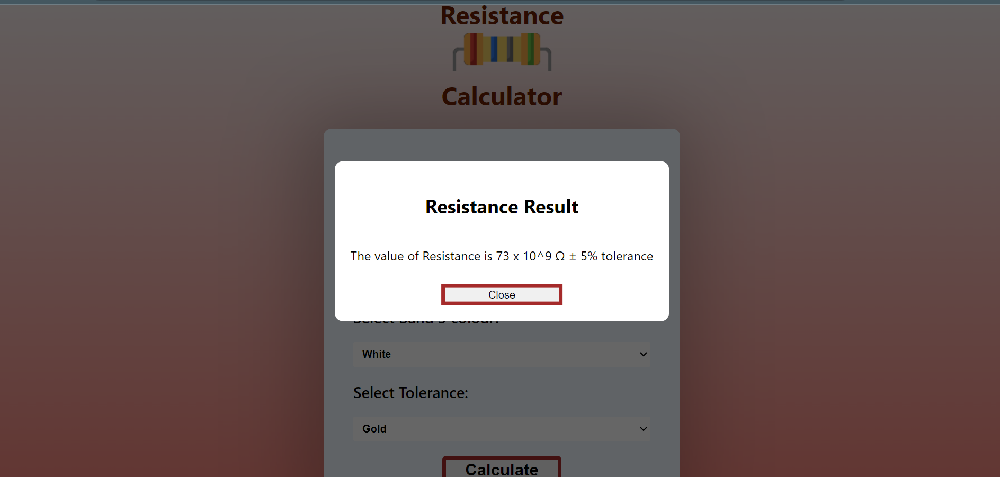
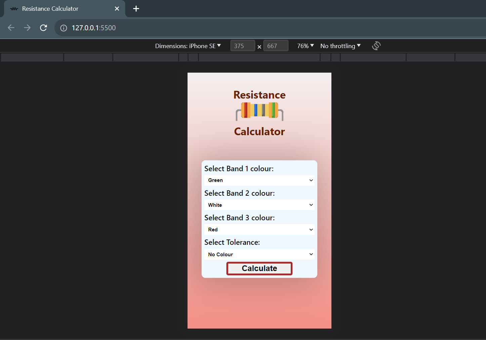
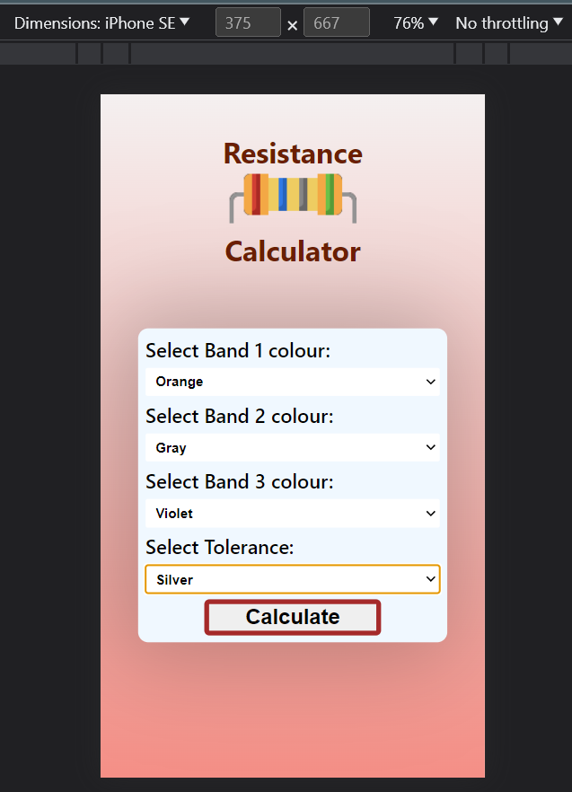
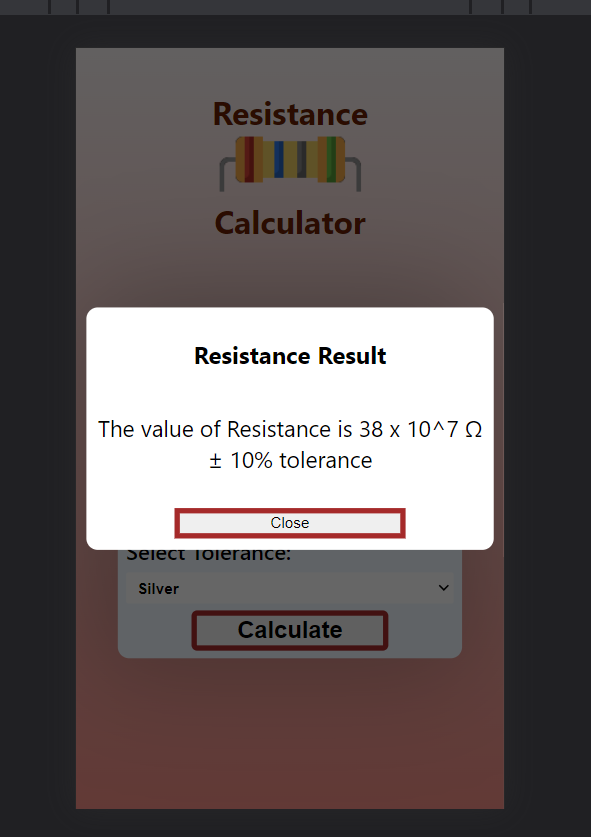

# 
4 Band Resistance Calculator

# Description :-

As the name suggest this is a Calculator which will help you calculate the resistance value by input the 4 colour bands present on the resistor and it will return the resistance value for it with including the tolerance value. The calculator is responsive also and can be viewed on any device.

## Tech Stacks :-

- HTML 
- CSS 
- Javascript

## Features :-

- Gives the theoretical reistance value of a given resistor.

## Screenshots :-

---

---

---

---

---

---
