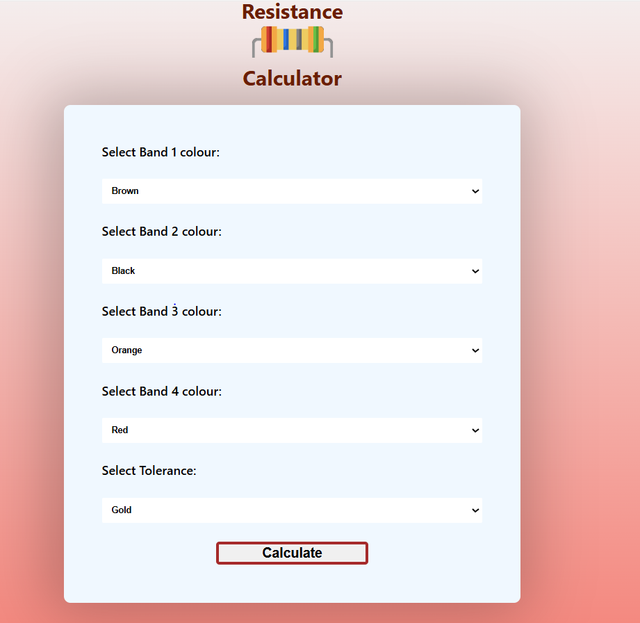
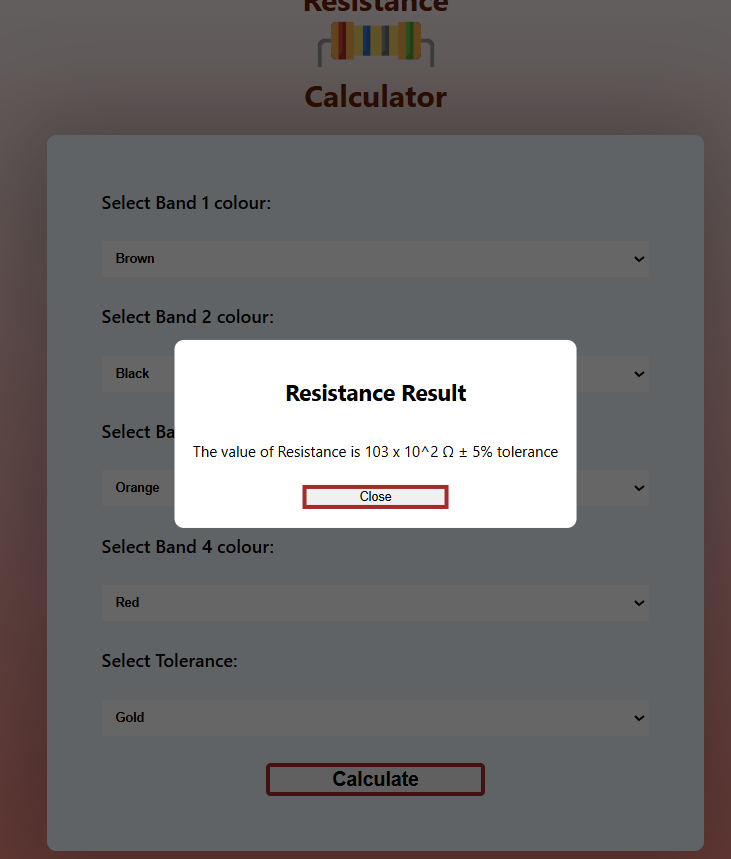

# 
5 Band Resistance Calculator

# Description :-

This is a calculator that will help you calculate the resistance value by inputting the 5 color bands present on the resistor and it will return the resistance value for it including the tolerance value.

## Tech Stacks :-

- HTML 
- CSS 
- JavaScript

## Features :-

- Gives the theoretical resistance value of a given resistor.
- The calculator is responsive also and can be viewed on any device.

## Screenshots :-

