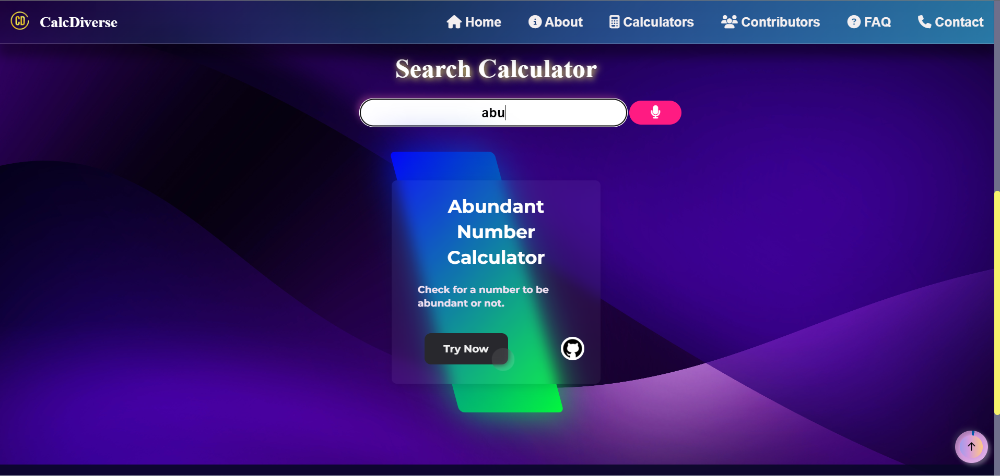
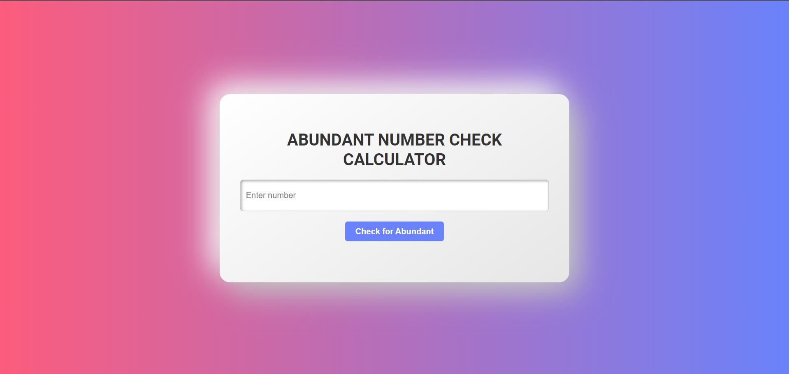
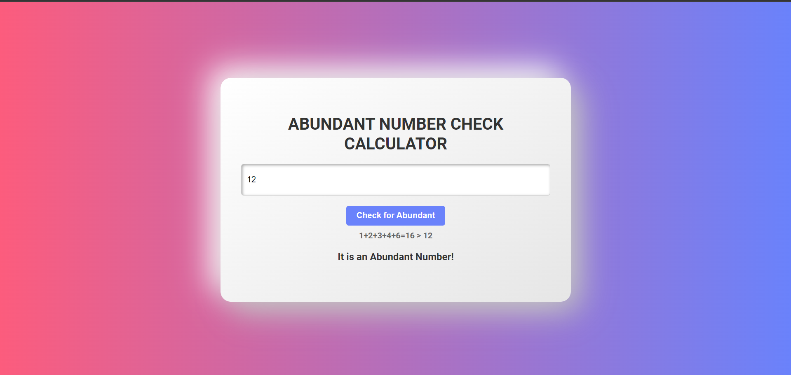
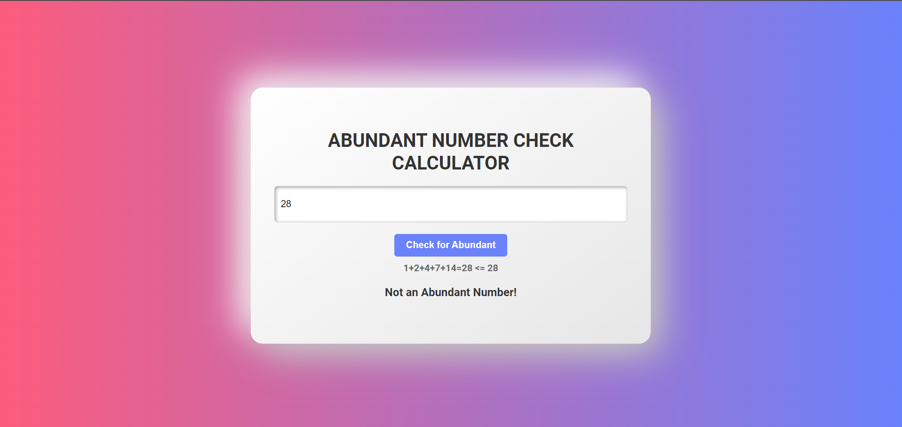

# 
Abundant Number Calculator

## Description :-

This is a simple web application that allows users to check if a given number is a abundant number. 
A abundant number is a positive integer that is greater to the sum of its proper divisors, excluding itself. 

For example, the number 12 is a abundant number because its proper divisors are 1, 2, and 3,4,6 and 1+2+3+4+6=16, which is greater to the number itself.

## Tech Stacks :-

- HTML
- CSS
- JavaScript

## Features :-

- Users can input a number.
- Upon clicking the "Check for Abundant" button, the application checks whether the entered number is a abundant number.
- The result is displayed below the input field, indicating whether the number is abundant or not.

## Screenshots :-

---

---

---

---
