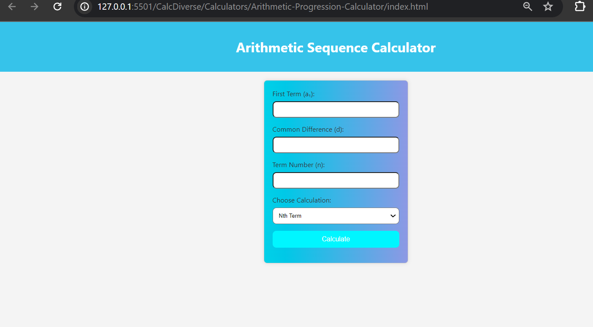

# 
Geometric-Progression-Calculator Calculator

## Description :-

Calculates nth Term and sum of n Terms present in an Arithematic Sequence.

## Tech Stacks :-

- HTML
- CSS
- JavaScript

## Screenshots :-

