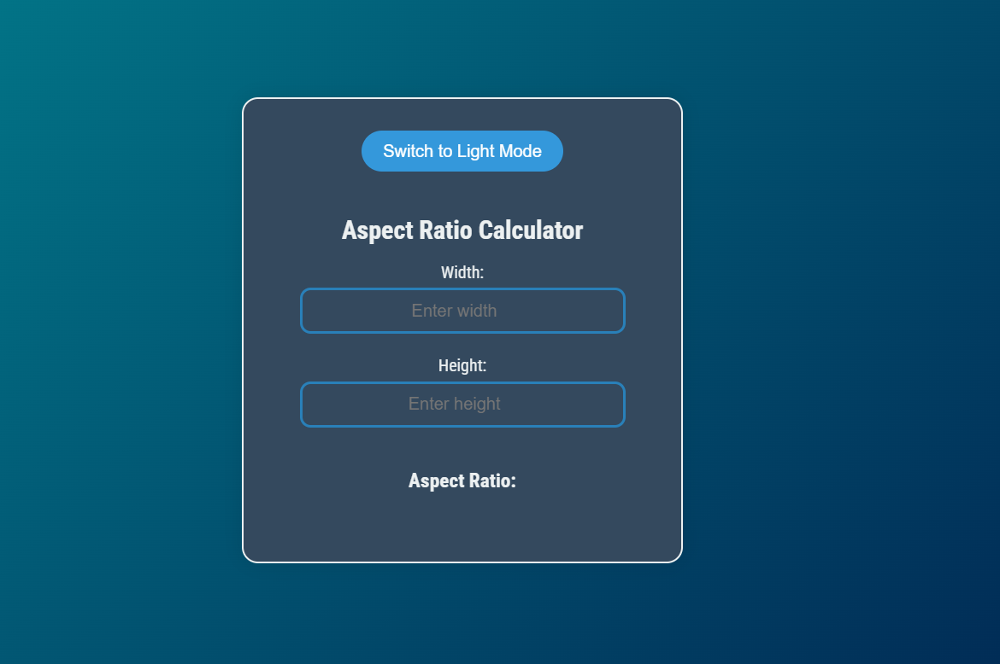
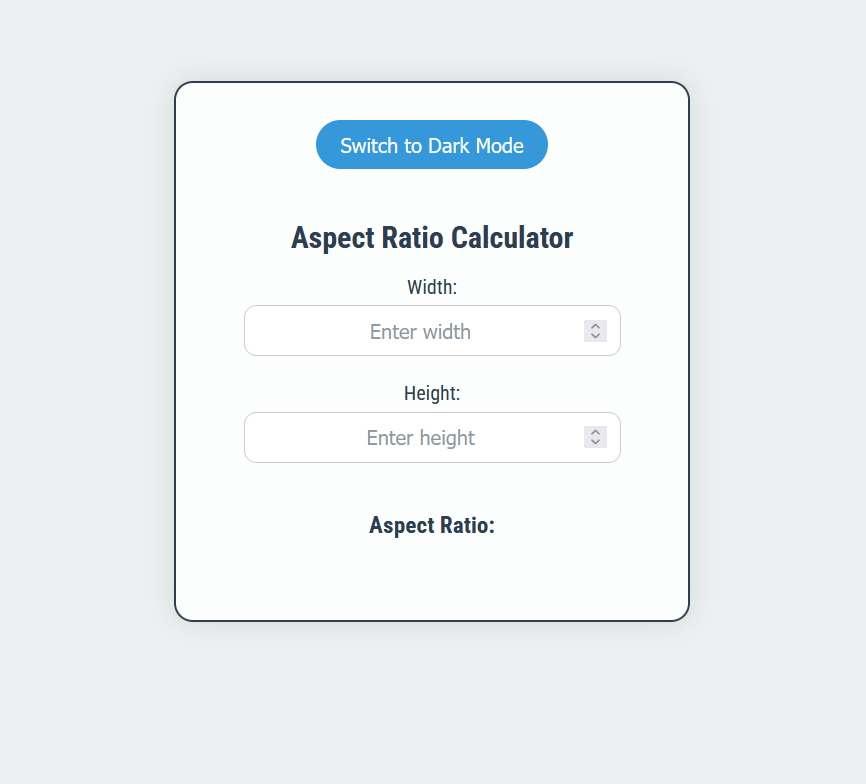

# 
Aspect Ratio Calculator

## Description :-

This is a simple Aspect Ratio Calculator that allows users to input width and height values and calculates the simplified aspect ratio. The calculator uses the greatest common divisor (GCD) to simplify the ratio. Also, this calculator also provides a toggle switch to switch between dark and light mode.

## Tech Stacks :-

- HTML
- CSS
- JavaScript

## Screenshots :-

### Dark Mode

### Light Mode

