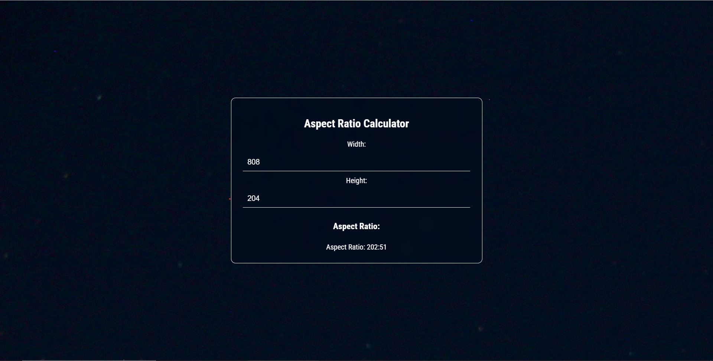

This is a simple Aspect Ratio Calculator that allows users to input width and height values and calculates the simplified aspect ratio. The calculator uses the greatest common divisor (GCD) to simplify the ratio.

## Tech Stacks

- HTML
- CSS
- JavaScript

## Screenshots

