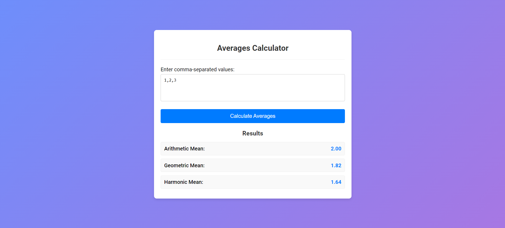

# Averages Calculator

## Overview
This is a simple web-based averages calculator that allows users to input comma-separated values and calculates the arithmetic, geometric, and harmonic means.

## Technologies Used
- HTML
- CSS
- JavaScript

## Features
- Input validation ensures only numerical values are accepted.
- Calculates arithmetic mean, geometric mean, and harmonic mean.
- Clean and responsive user interface.

## Screenshots
