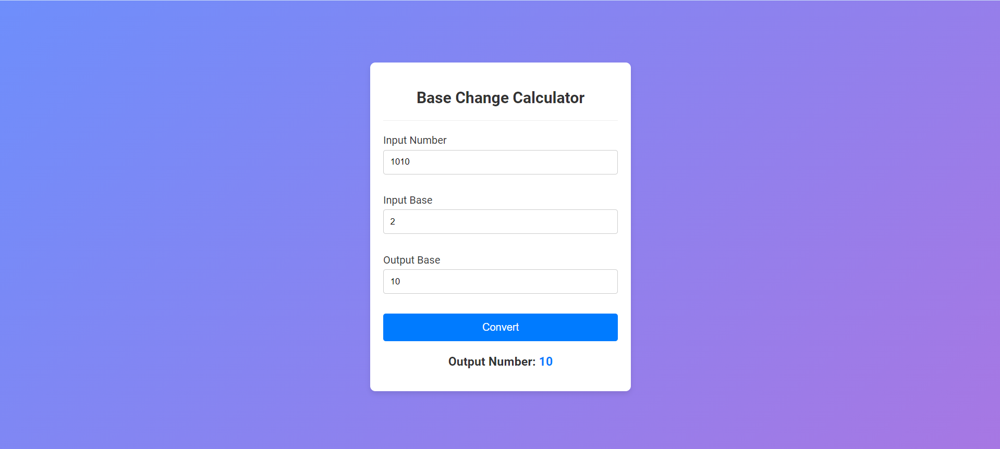

# Base Change Calculator

## Overview
The Base Change Calculator is a web-based application that allows users to convert a number from one base to another. The calculator takes an input number, the base of the input number, and the desired base for the output number, and then performs the conversion.

## Technologies Used
- HTML
- CSS
- JavaScript

## Features
- Converts a number from one base to another.
- Validates the input number and bases.
- Provides instant conversion results.

## Example
1. Input Number: `1010`
2. Input Base: `2`
3. Output Base: `10`
4. Result: `10`

## Screenshots

