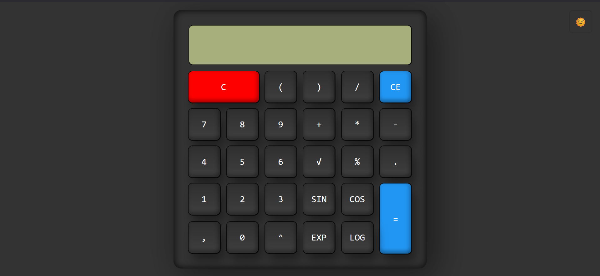

# 
Basic Calculator

## Description :-

This calculator will help you calculate your basic arithmetic calculations. This is your user friendly basic calculator. It has added functionality of switching between dark and light mode. It has a modern design with a simple and easy to use interface. 

## Tech Stack :-

- HTML
- CSS
- JavaScript

## Screenshot :-
### Dark Mode:
   
### Light Mode:
