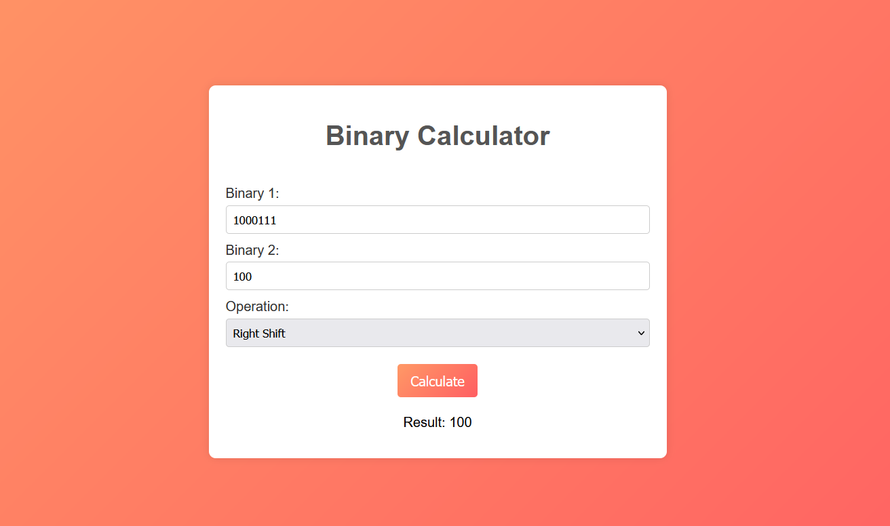

# 
Binary Calculator

This web application allows you to perform various binary operations on given binary numbers. With this calculator, you can easily perform binary addition, binary subtraction, binary multiplication, left shift, right shift, and more.

## Features

- Binary Addition: Add two binary numbers together.
- Binary Subtraction: Subtract one binary number from another.
- Binary Multiplication: Multiply two binary numbers.
- Left Shift: Shift the bits of a binary number to the left.
- Right Shift: Shift the bits of a binary number to the right.

## Technologies Used

- HTML
- CSS
- JavaScript

## Screenshots

