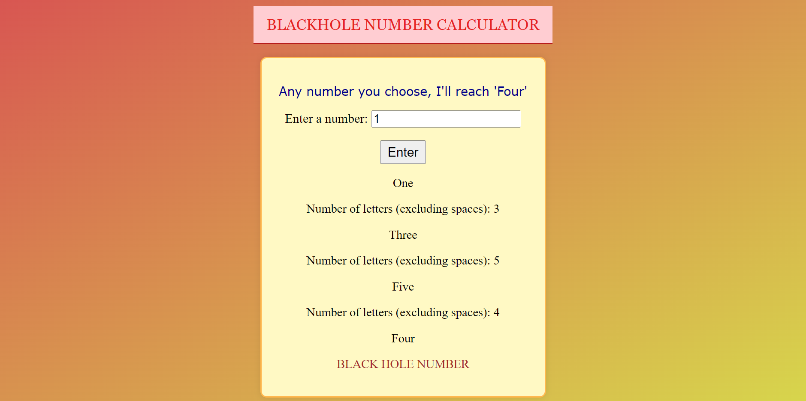

# **Black Hole Number Calculator**

 

## **Description** 
- Black Hole number Calculator is a simple fun calculator that takes whatever number you give and at last always the ends at four. Number 4 is referred to as Black Hole number because every word you spell will end in Four.

## **Tech Stacks**
- HTML
- CSS
- JS

## **Screenshots**

