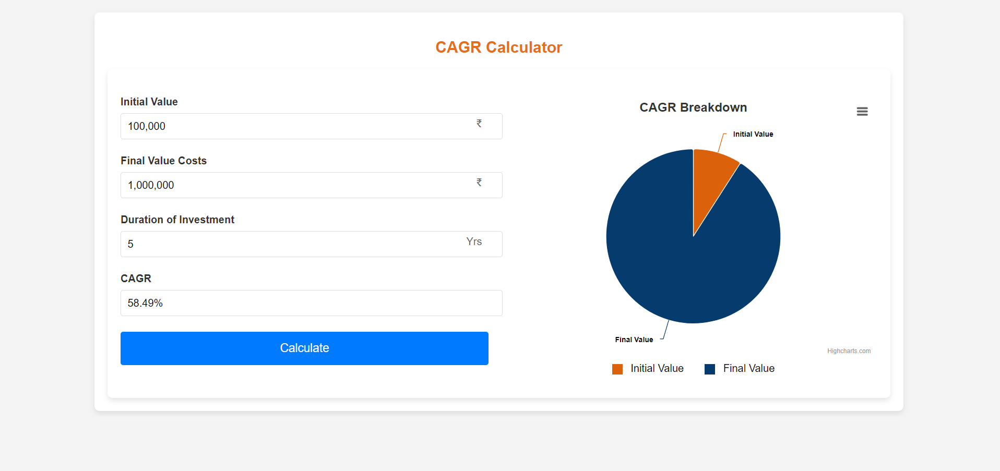
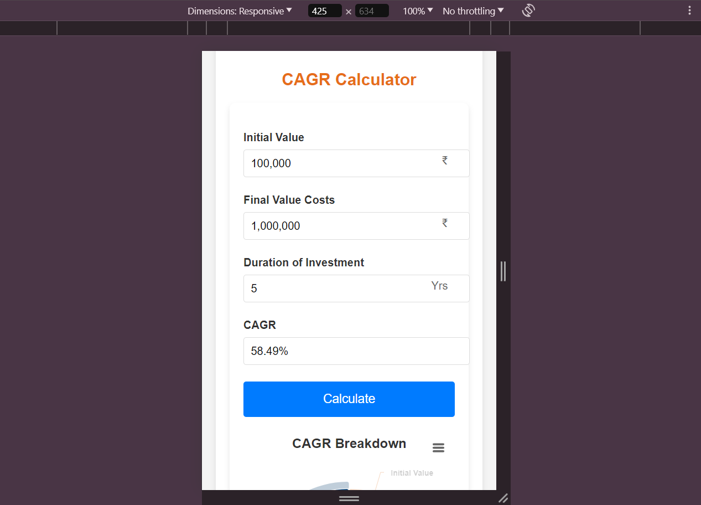

# 
CAGR Calculator

## Description

The CAGR (Compound Annual Growth Rate) Calculator is a web application that allows users to calculate the CAGR of an investment over a specified period. Users can input the initial value, final value, and duration of the investment to calculate the CAGR. The results are displayed in both text and graphical formats using a doughnut chart.

## Tech Stacks

- **HTML5**: For structuring the content on the web.
- **CSS3**: For styling the web application.
- **JavaScript**: For implementing the logic and interactivity.
- **Highcharts**: For rendering the interactive doughnut chart.

## Features

- Responsive design: The form and chart are displayed side by side on larger screens and stacked vertically on smaller screens.
- Doughnut chart visualization: Uses Highcharts to display the breakdown of the initial and final values.
- User-friendly input fields: Input fields for initial value, final value, and duration of investment.
- Real-time calculation: Calculates and displays the CAGR when the user clicks the "Calculate" button.
- Pre-filled default values: Displays a default chart on page load with pre-filled initial values.

## Screenshots

### Desktop View

### Mobile View

