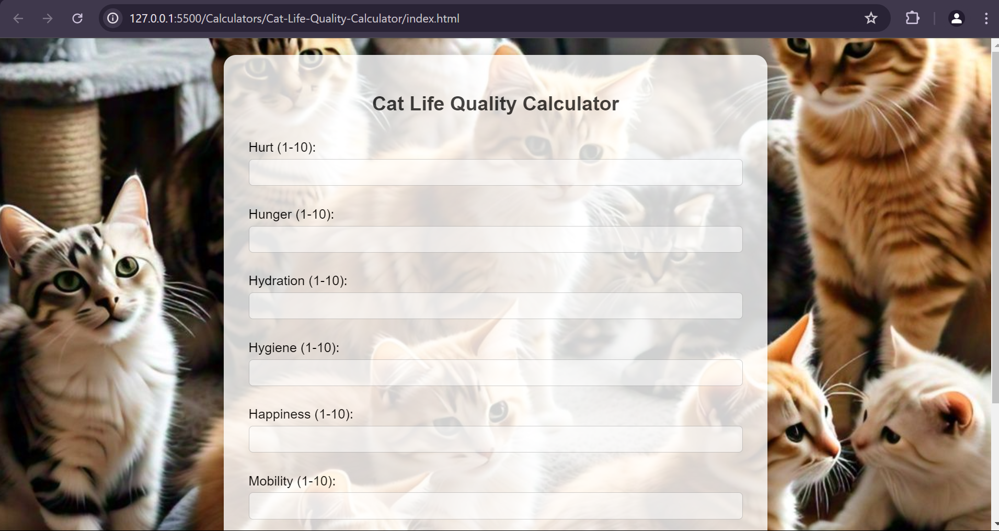

# Cat Life Quality Calculator

## Overview

The **Cat Life Quality Calculator** is a simple web application that helps cat owners assess the quality of life of their pets based on several criteria. This tool can aid in making informed decisions regarding the care and well-being of your feline friends.

## Features

- Input fields for various life quality criteria including Hurt, Hunger, Hydration, Hygiene, Happiness, Mobility, and More Good Days than Bad.
- Calculation of total score based on user input.
- Display  the cat's life quality rating (Excellent, Good, Fair, Poor) based on the total score.
- Responsive and visually appealing interface with background images of cats.

## Technologies Used

- HTML
- CSS
- JavaScript

## Usage

1. Open `index.html` in your preferred web browser.
2. Fill in each input field with a value from 1 to 10 for each criterion.
3. Click the "Calculate Life Quality" button.
4. View the result displaying the cat's life quality rating and the total score.

## ScreenShot
