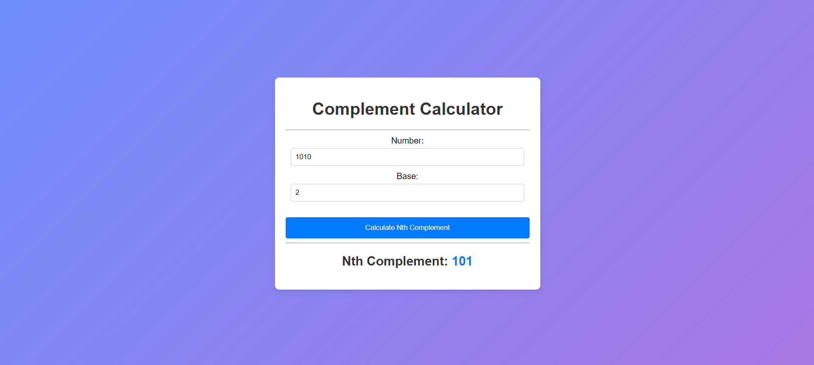

# Complement Calculator

## Overview

The Complement Calculator is a web-based application that calculates the nth complement of a given number in a specified base. The calculator takes an input number and its base, computes the nth complement, and displays the result.

## Technologies Used

- HTML
- CSS
- JavaScript

## Features

- Converts the input number to its binary representation.
- Computes the nth complement of the binary number.
- Converts the complemented binary number back to the specified base.
- Displays the complemented number in the specified base.

## Example

1. Input Number: `1010`
2. Base: `2`
3. Result: `0101` (nth complement in binary)

## Screenshots

