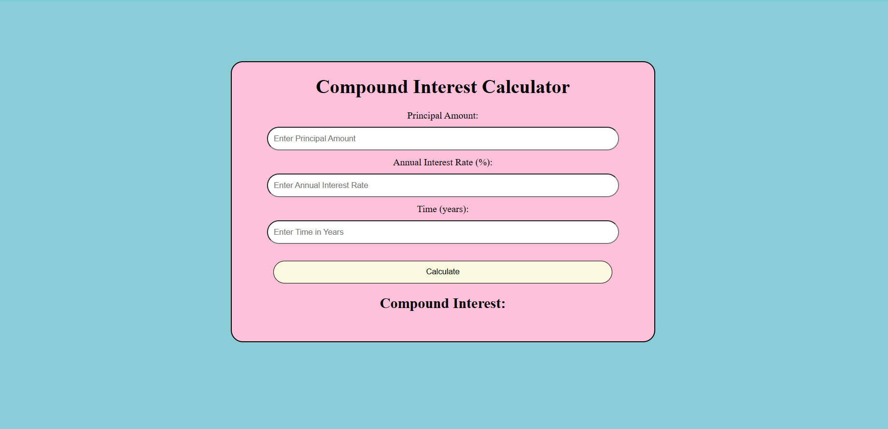

<h1 style="text-align:center;">Compound Interest Calculator </h1>
<h3 style="text-align:center;">In this calculator we can calculate the Compound Interest by giving the suitable inputs of principal amount, rate of interest, and the time in years.   
It calculates the Amount as soon as we click the calculate button.
</h3>
 
<h2>Screen-Shot:</h2>

