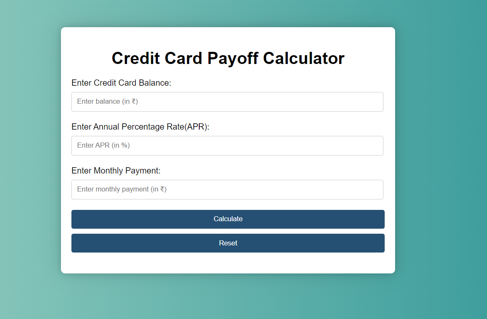

# Credit Card Payoff Calculator

 This is a credit card payoff calculator that helps you determine how long it will take to pay off your credit card debt, given your current balance, interest rate, and monthly payment. It can also help you calculate how much interest you will pay over the life of the loan. 

## How to use the calculator:

1) Enter your current credit card balance in the "Enter Credit Card Balance" field.
2) Enter your annual percentage rate (APR) in the "Enter Annual Percentage Rate(APR)" field.
3) Enter your monthly payment in the "Enter Monthly Payment" field.
4) Click the "Calculate" button.

### The calculator will display the following results:

The number of years and months it will take to pay off your credit card debt.

## Benefits of using the credit card payoff calculator:

It can help you understand how much debt you really have.
It can help you create a plan to pay off your debt faster.
It can help you save money on interest.

## Screenshots:

