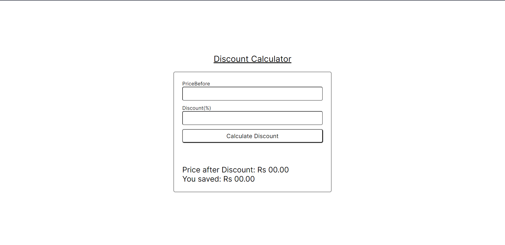

# Discount Calculator

A simple web-based discount integral calculator that allows users to calculate reduced price of a product and the amount of money you save.

## Features

- Calculate calculate reduced price of a product and the amount of money you save.
- User-friendly interface with input fields for Before Price and Discount percentage
- Real-time calculation and display of results.
- Responsive design for optimal user experience on different devices.

## Usage

1. Open the `index.html` file in a web browser.
2. Enter the Before Price of the item.
3. Specify the Discount percentage on the item.
4. Click the "Calculate" button to compute the definite integral.
5. View the result displayed on the page.

## Example

For example, to calculate price of an item which cost 100RS after Discount of 10%:
- Enter 100 in the Before Price input field.
- Enter 10% as Discount price.
- Click "Calculate" to see the result.

## Tech Stack

- HTML
- CSS
- JavaScript

## Screenshot

