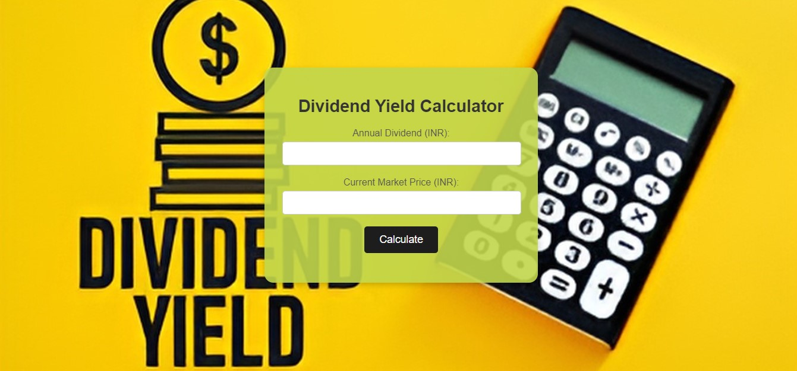

# 
Dividend Calculator

## Description :-

The Dividend Yield Calculator effortlessly calculates the % Dividend yield which is used to assess potential income from investments, compare dividend-paying stocks, and make informed investment decisions based on risk and long-term financial goals.

## Tech Stacks :-

- HTML
- CSS
- JavaScript

## Screenshots :-

