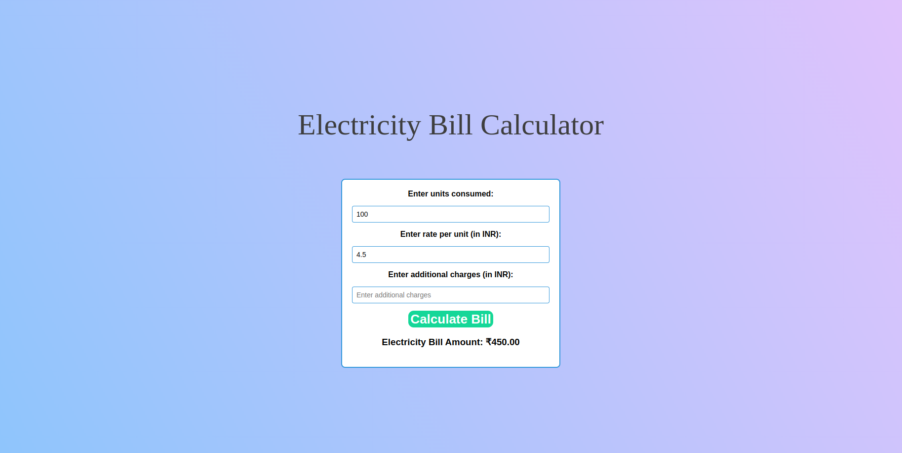

# 
Electricity Bill Calculator

## Introduction

The Electricity Bill Calculator is a web application designed to help users estimate their electricity bills. Users can input the consumed units, rate per unit, and additional charges to calculate the total electricity bill amount.

## Features

- Calculate electricity bill based on units, rate per unit, and additional charges
- User-friendly interface
- Real-time bill calculation

## Tech Stacks Used

- HTML
- CSS
- JavaScript

## Screenshots

