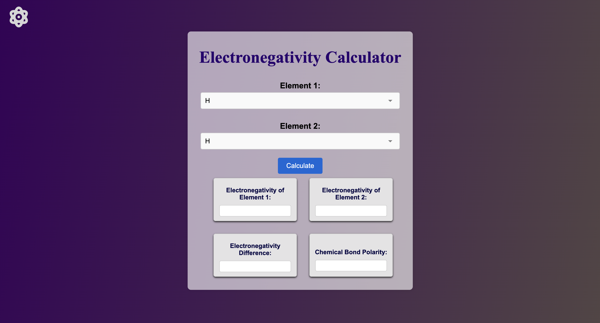

# 
Electronegativity Calculator

## Description :-

The calculator designed is an electronegativity calculator that allows users to select two elements from dropdown menus. Upon selection, the calculator displays the electronegativity values of both elements, calculates their difference, and determines the polarity of the chemical bond formed between them. The results are shown in four input fields: electronegativity of element 1, electronegativity of element 2, electronegativity difference, and chemical bond polarity.

This calculator is useful for understanding and predicting the nature of chemical bonds based on electronegativity values, providing educational and practical insights into chemical interactions.

## Tech Stacks :-

- HTML
- CSS
- JavaScript

## Screenshots :-

