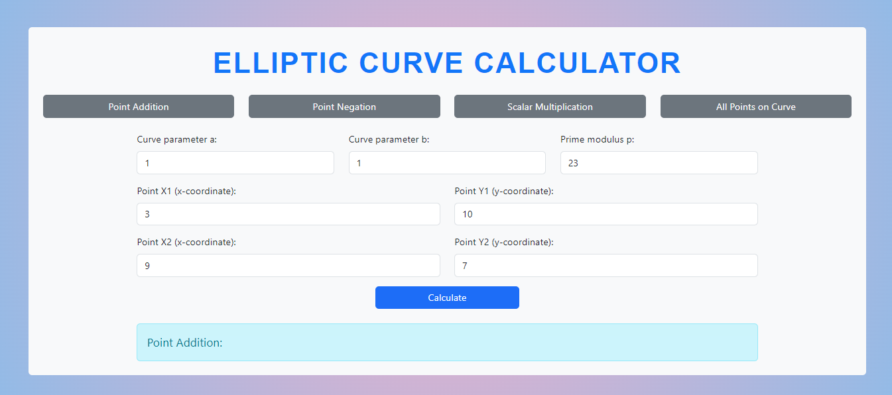
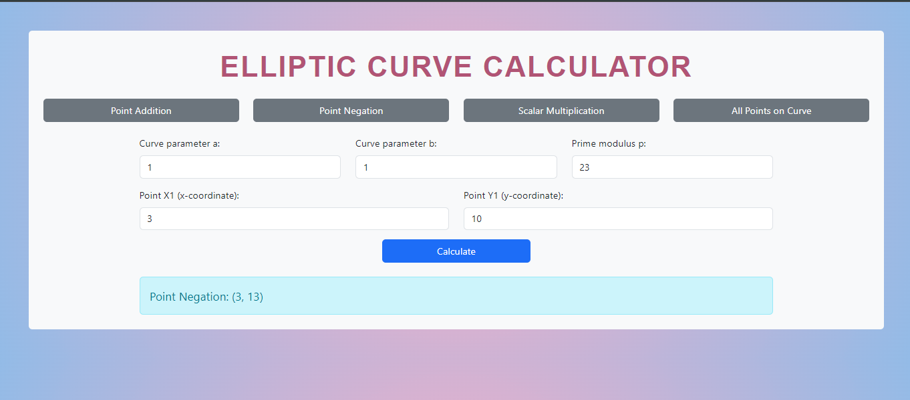
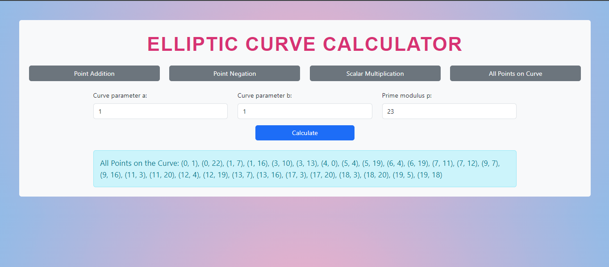

# 
Air Quality Index Calculator

## Description :-

Calculates the following things for an elliptic curve:-

1. Addition of 2 points
2. Negation of a point
3. Multiplication of a point with a scalar
4. All points on the curve

## Tech Stacks :-

- HTML
- CSS
- JavaScript

## Screenshots :-

