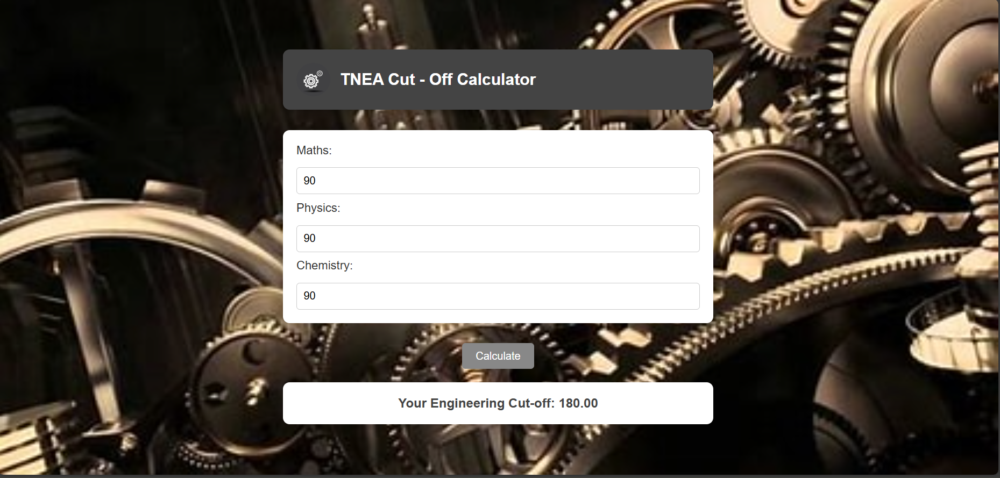

# 
TNEA Cut - Off Calculator

# Description :-

TNEA (Tamilnadu Engineering Admissions) Cut - Off is calculated with respect to the maths, physics and chemistry marks obtained by the user.

## Tech Stacks :-

- HTML
- CSS
- JavaScript

## Formula Used :-

![Formula]https://i.ytimg.com/vi/w_mXr1WMG2g/maxresdefault.jpg
## Screenshots :-

![image]