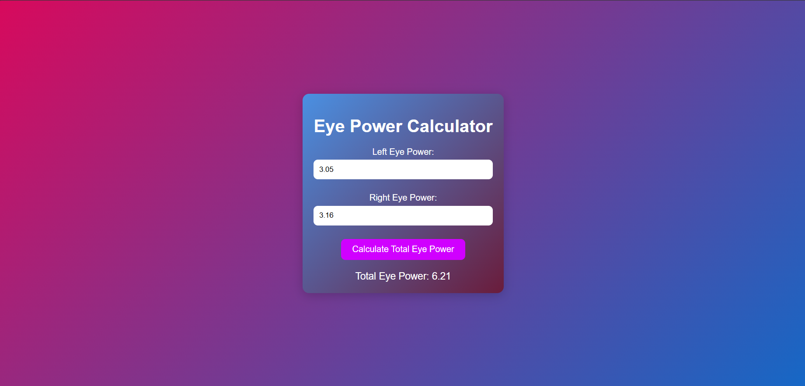

#
Calculate Eye Power from Lens Prescription

#Description
This web application calculates the eye power based on the user's lens prescription values. It provides a simple interface for entering prescription data and obtaining the calculated eye power.

##Tech Stacks:
HTML: Structure of the calculator interface.
CSS: Styling for visual aesthetics.
JavaScript: Logic for calculating eye power based on input values.

##Formula Used:
The eye power (P) is calculated using the following formula
[Formula](https://sightonomy.sg/blogs/learn/prescriptions)

#Screenshots:

