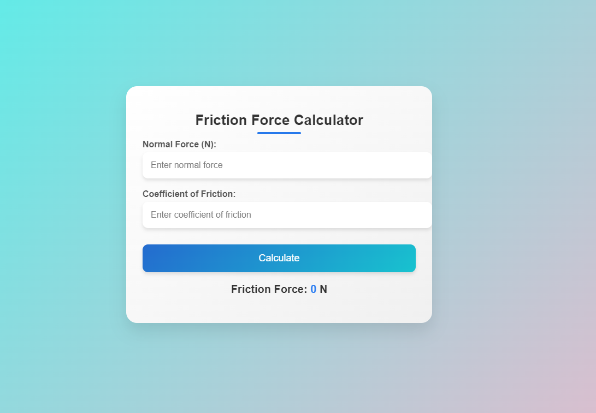

# 
Friction Force Calculator

## Description :-

Friction calculator to calculate the friction force between an object and the ground. It is based on a simple principle: friction is proportional to the normal force acting between the object and the ground.

## Tech Stacks :-

- HTML
- CSS
- JavaScript

## Screenshots :-

