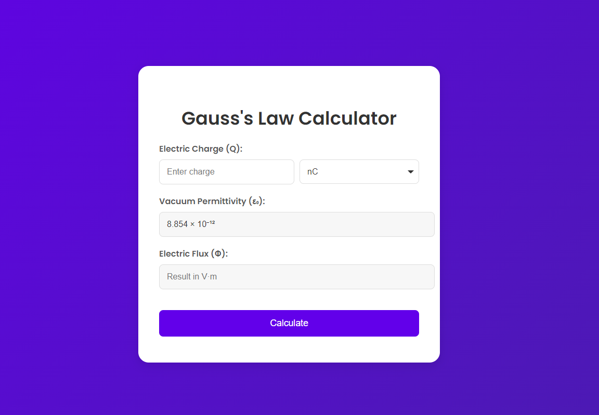

# 
Gauss's Law Calculator

## Description :-

A Gauss's law calculator is a tool that helps compute the electric flux through a closed surface or the electric field due to a given charge distribution. It utilizes Gauss's law, which states that the net electric flux through any closed surface is proportional to the enclosed electric charge. This tool can simplify calculations involving symmetric charge distributions, such as spherical, cylindrical, or planar symmetries. It's useful for visualizing electric field lines and understanding electrostatic principles in physics.

## Tech Stacks :-

- HTML
- CSS
- JavaScript

## Screenshots :-

