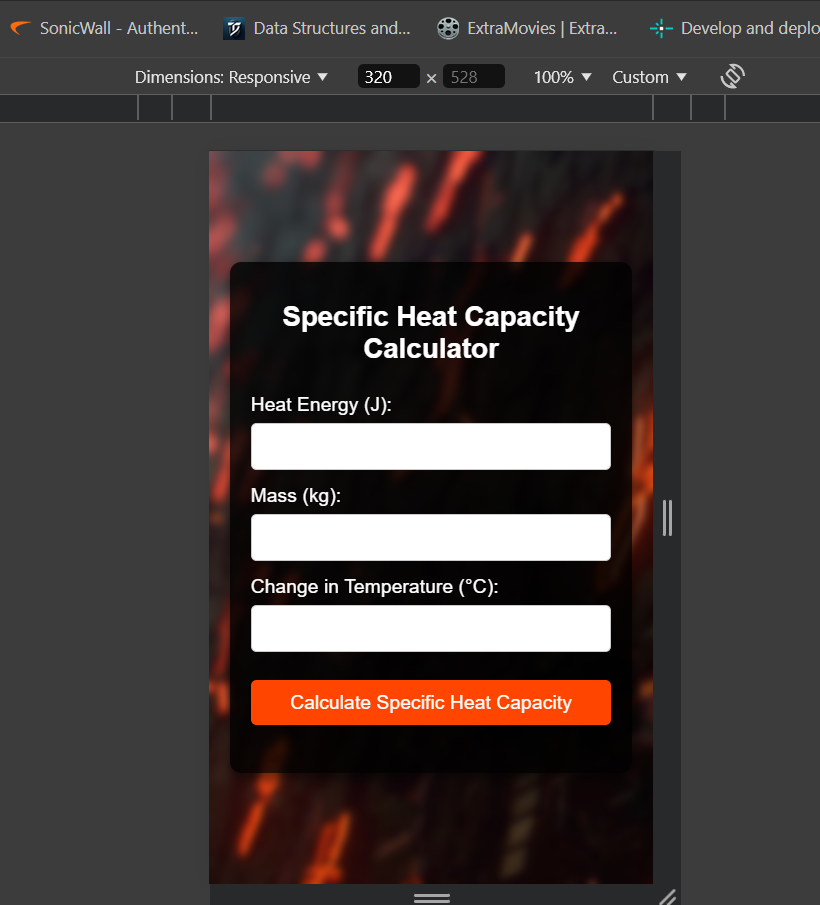

# Specific Heat Capacity Calculator

This project is a simple web-based calculator for determining the specific heat capacity of a substance. It calculates the specific heat capacity based on the provided heat energy, mass, and change in temperature.

## Table of Contents
- [Overview](#overview)
- [Features](#features)
- [Technologies Used](#technologies-used)
- [Usage](#usage)
- [Screenshots](#screenshots)

## Overview

The Specific Heat Capacity Calculator is a web application that helps users calculate the specific heat capacity of a material. The calculator takes three inputs:
1. Heat Energy (Joules)
2. Mass (kg)
3. Change in Temperature (°C)

It then calculates the specific heat capacity using the formula:

${C = Q / (m ΔT)}$

Where:
- \( C \) is the specific heat capacity (J/kg°C)
- \( Q \) is the heat energy (Joules)
- \( m \) is the mass (kg)
- \( ΔT \) is the change in temperature (°C)

## Features

- Responsive design for optimal viewing on various devices.
- Easy-to-use interface with labeled input fields.
- Error handling for invalid inputs.
- Background image for an engaging visual experience.

## Technologies Used

- **HTML**: Structure and content of the web page.
- **CSS**: Styling for the web page, including responsive design.
- **JavaScript**: Functionality for calculating specific heat capacity and displaying results.

## Usage

- Enter the required values:
- Heat Energy (in Joules)
- Mass (in kg)
- Change in Temperature (in °C)
- Click on the **"Calculate Specific Heat Capacity"** button.

- View the result:

The specific heat capacity will be displayed below the button.

## ScreenShots

