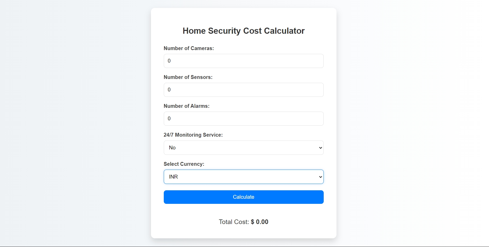

# Home Security Cost Calculator

This is a simple web-based calculator designed to estimate the cost of setting up a home security system. It takes into account the number of cameras, sensors, alarms, and 24/7 monitoring service, allowing users to calculate the total cost based on their requirements.

## Features

- Input fields for number of cameras, sensors, and alarms.
- Option to include 24/7 monitoring service.
- Currency selection for displaying total cost in different currencies.
- Modern and user-friendly interface.
- Professional design with a background image related to home security.

## Usage

1. Clone this repository to your local machine.
2. Open `index.html` in your web browser.
3. Fill in the required fields with your desired values:
    - Number of Cameras
    - Number of Sensors
    - Number of Alarms
    - 24/7 Monitoring Service (optional)
    - Select Currency
4. Click on the "Calculate" button to see the estimated total cost.

## Technologies Used

- HTML
- CSS
- JavaScript

## Screenshots

## Credits

This project is inspired by the need for a simple tool to estimate home security system costs. The design and functionality are created by [Nikita].
