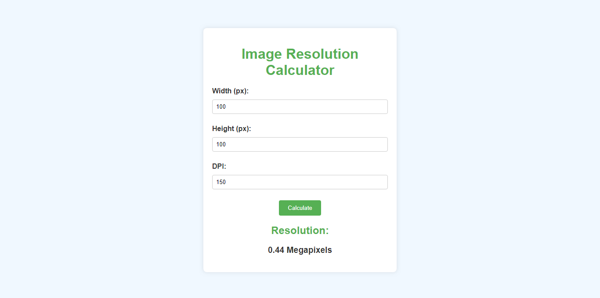

# 
Image Resolution Calculator

## Description :-

A simple web application that calculates the resolution in megapixels based on user input dimensions (width and height in pixels) and DPI (dots per inch).

## Tech Stacks :-

- HTML
- CSS
- JavaScript

## Screenshots :-

 <!-- Replace with actual screenshot URL -->
