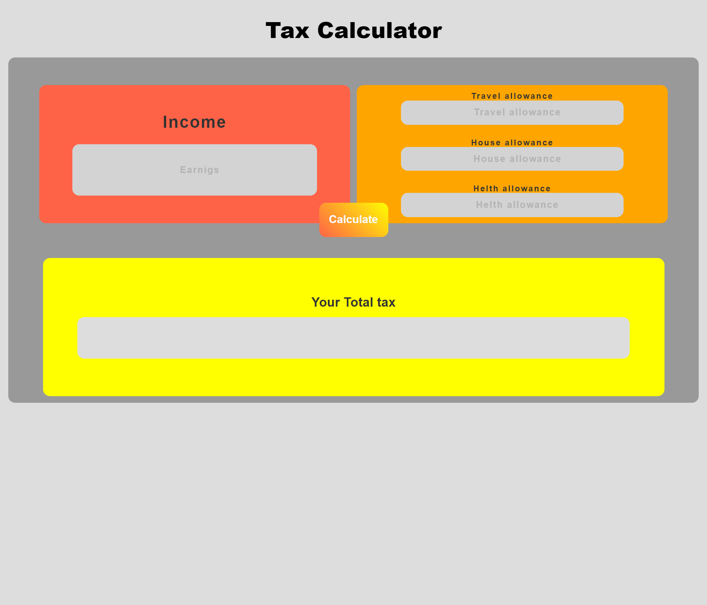

# 
Income Tax Calculator

## Overview

The provided code implements a basic income tax calculator web application. Users can input their annual income, and upon submission, the calculator computes the income tax based on predefined tax brackets. The calculated tax amount is displayed on the webpage. The calculator utilizes HTML for structure, CSS for styling, and JavaScript for functionality, providing a simple interface for users to estimate their income tax liability.
## Features

### Input Fields:

- **Annual Income:** Enter the annual income of the person.

### Output:

- The result is displayed on the page, showing the calculated income tax.

## Usage

1. Enter the person's anuual income.
2. Click the "Calculate" button to see the calculated income tax.

## Disclaimer

This calculator provides general information and is not a substitute for professional income tax calculation. Visit official website for actual information.
