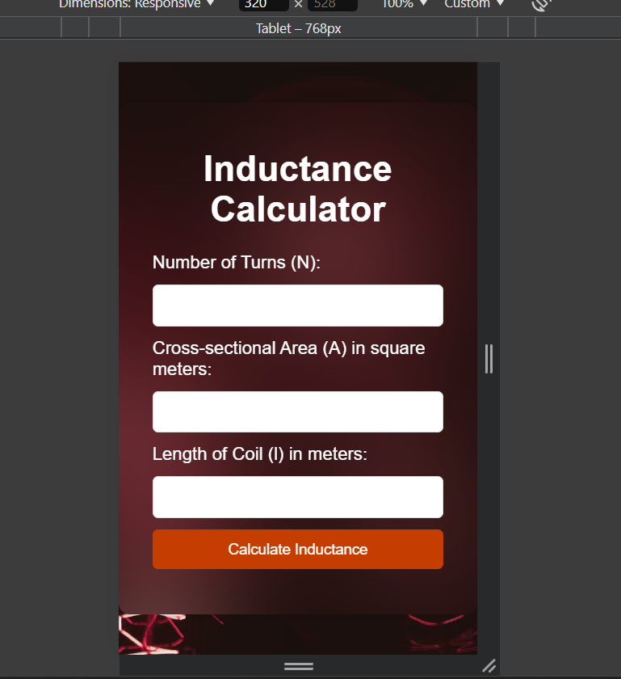

# Inductance Calculator

## Description

This project is a simple web-based **Inductance Calculator** that allows users to calculate the inductance of a coil based on parameters such as the number of turns, coil diameter, coil length, and core material. It is designed with a user-friendly interface, making it easy to input values and obtain the inductance result quickly.

## Formula Used

The inductance \( L \) of a solenoid is calculated using the following formula:

​
${L}$ = μ$N^2$ ${A/l}$

Where:
- L = Inductance (Henries)
-N = Number of turns
- A = Cross-sectional area of the coil 
- L = Length of the coil

## Tech Stack

- **HTML5**: For structuring the calculator interface.
- **CSS3**: For styling the page and ensuring a responsive design.

## Screenshot

