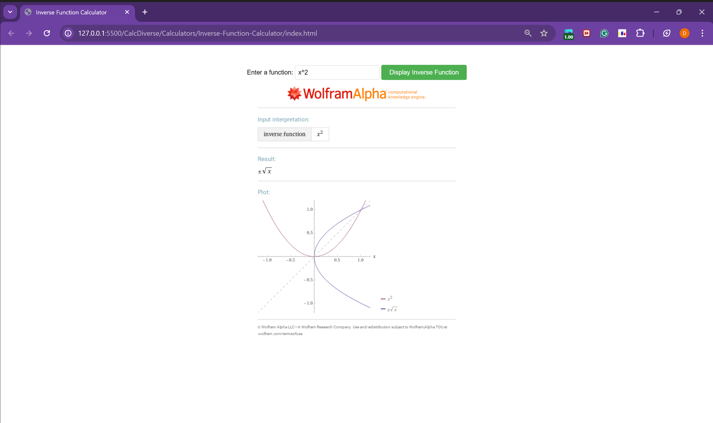

# Inverse Function Finder

This is a simple web-based tool that allows users to find the inverse of various types of mathematical functions, including polynomial, trigonometric, logarithmic, and exponential functions. The tool leverages the Wolfram Alpha API for symbolic computation to determine the inverse function.

## Features 

- Input any function in terms of `x`.
- Fetch and display the inverse of the input function using the Wolfram Alpha API.

## Technologies Used

- HTML
- CSS
- JavaScript
- [Axios](https://axios-http.com/) for making HTTP requests
- [Wolfram Alpha API](https://products.wolframalpha.com/api/) for symbolic computation

## Usage

1. Enter a function in terms of `x` in the input field.
2. Click on the "Find Inverse" button.
3. The inverse function will be displayed below the input form.

## Screenshots
