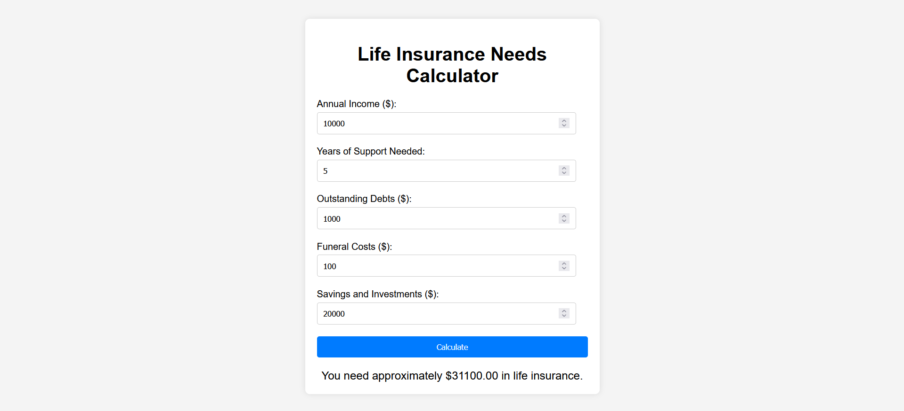

# Web Life Insurance Needs Calculator

This is a web-based life insurance needs calculator that helps users determine how much life insurance they need based on their annual income, years of support needed, outstanding debts, funeral costs, savings, and investments.

## Features

- Input fields for annual income, years of support needed, outstanding debts, funeral costs, savings, and investments.
- Calculation of the total life insurance needed based on the provided inputs.
- Clear and intuitive user interface.
