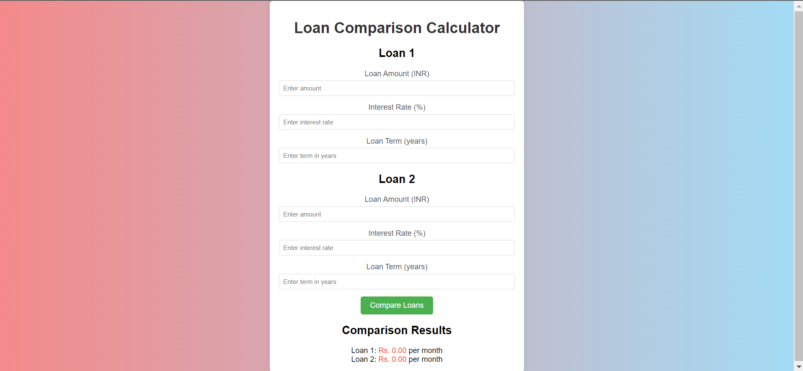
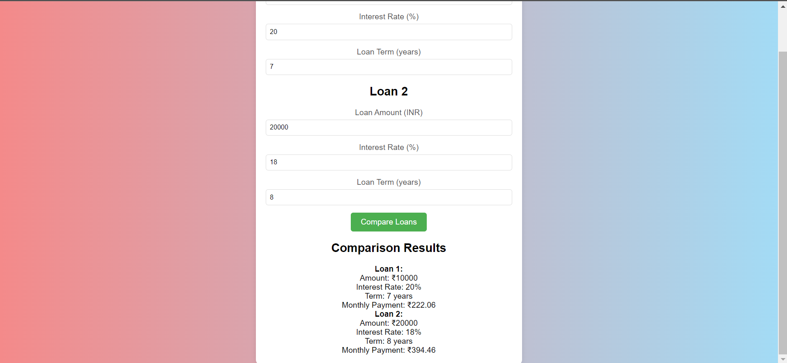

# 
Loan Comparison Calculator

## Description :-

Given the loan amount, interest rate (per year), and loan term (in years), this calculator compares the monthly payments of two loans. It helps users determine which loan option is more affordable by calculating the Equated Monthly Installment (EMI) for each loan.

## Tech Stacks :-

- HTML
- CSS
- JavaScript

## Screenshots :-

