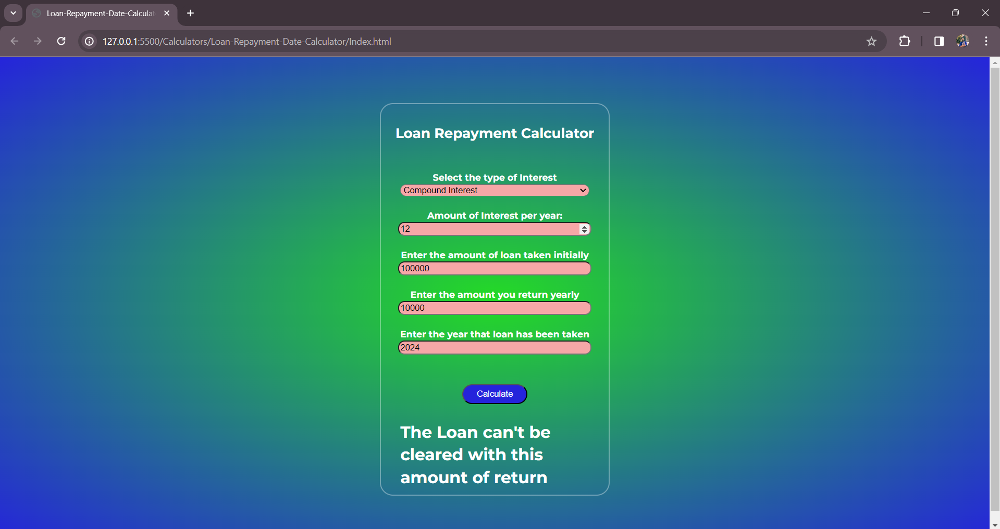

# 
Loan Repayment Calculator

## Description :-

This is a loan repayment date calculator which gives you the year by which your load will be cleared. This calculator requires the loan amount, the interest, the return amount, the loan approval year and the type of interest(simple or compound) as input and gives the output as a year by ehich the loan would be cleared.

## Tech Stacks:-

- HTML
- CSS
- JavaScript

## Screenshots :-

