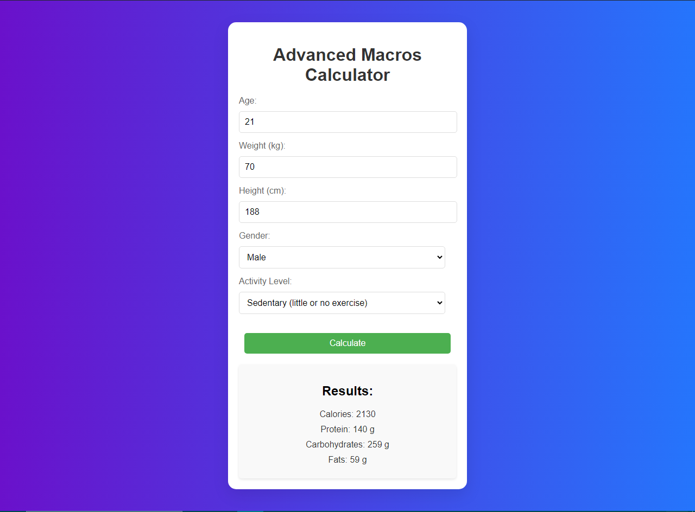

# 
Advanced Macros Calculator

## Description :-

The Advanced Macros Calculator helps users determine their daily macronutrient needs based on their age, weight, height, gender, and activity level. By inputting these details, users can calculate their Total Daily Energy Expenditure (TDEE) and get recommendations for protein, carbohydrates, and fats. This tool is useful for individuals looking to manage their diet and optimize their nutrition.

## Tech Stacks :-

- HTML
- CSS
- JavaScript

## How It Works :-

The Advanced Macros Calculator uses a series of steps to compute and display the macronutrient needs. Here's a high-level overview:

1. **Input Values:**
   Users enter their age, weight, height, gender, and activity level into the input fields.

2. **BMR Calculation:**
   The Basal Metabolic Rate (BMR) is calculated using the Harris-Benedict equation, which differs for males and females.

3. **TDEE Calculation:**
   The Total Daily Energy Expenditure (TDEE) is computed by multiplying the BMR by the activity level factor.

4. **Macros Distribution:**
   - **Protein:** Calculated as 2 grams per kilogram of body weight.
   - **Fats:** Set to 25% of the total calorie intake, converted to grams.
   - **Carbohydrates:** The remaining calories are allocated to carbohydrates.

5. **Result Display:**
   The calculated values for calories, protein, carbohydrates, and fats are displayed to the user.

## Screenshots :-

