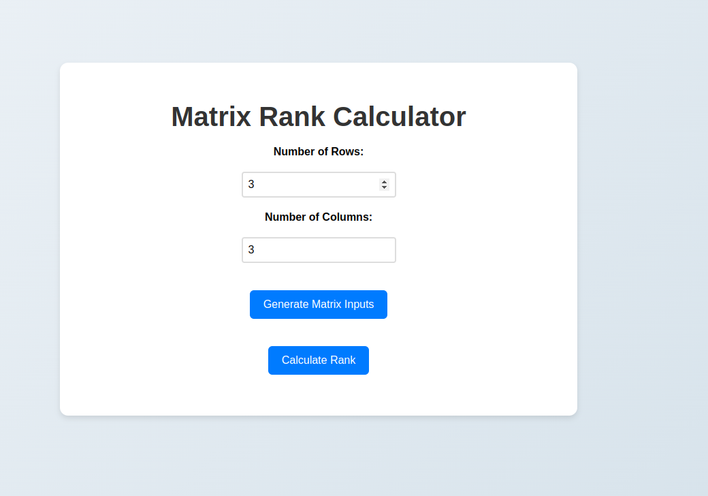
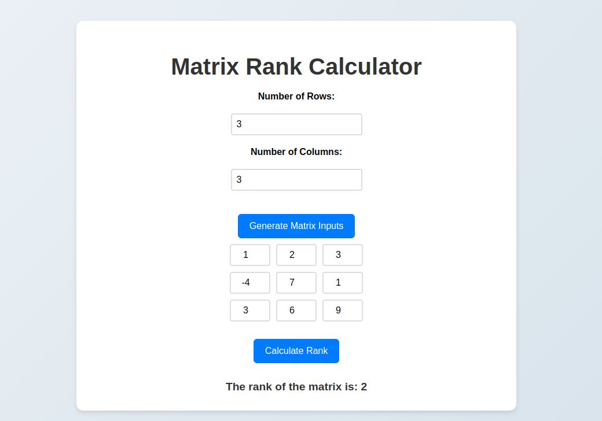

# Matrix Rank Calculator

## Description
The **Matrix Rank Calculator** is a web-based tool that allows users to calculate the rank of a matrix. Users can specify the dimensions of the matrix, input the values, and instantly get the rank. This tool is useful for students, mathematicians, and engineers who need to perform matrix operations quickly and efficiently.

## Tech Stack
- **HTML**: Structure of the web page.
- **CSS**: Styling and layout of the application, ensuring a responsive and modern design.
- **JavaScript**: Logic for generating matrix inputs, calculating the rank, and handling user interactions.

## Features
- User-friendly interface with a clean and modern design.
- Dynamic generation of matrix input fields based on user-specified dimensions.
- Modal popup for entering matrix values.
- Real-time calculation of matrix rank using Gaussian elimination.
- Responsive design, making it accessible on various devices.

## Screenshots
*Example of the Matrix Rank Calculator in action.*

## Usage
1. Enter the number of rows and columns for the matrix.
2. Click "Generate Matrix Inputs" to open the matrix input form in a modal.
3. Enter the values of the matrix.
4. Click "Calculate Rank" to view the rank of the matrix.
