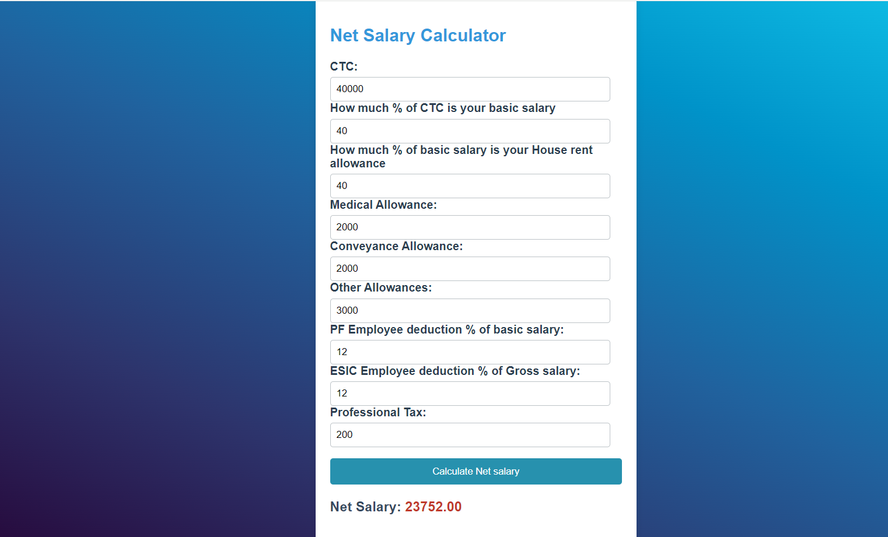

# 
Net Salary Calculator

## Description :-

This Net Salary Calculator is a valuable tool designed to assist you in determining the actual take-home pay from your Cost to Company (CTC). By inputting details such as your basic salary %, allowances, and deductions, the calculator provides a comprehensive overview of your net salar. Gain insights into your financial earnings after various deductions and make informed decisions about your finances with this user-friendly Net Salary Calculator.

## Tech Stack :-

- HTML
- CSS
- JavaScript

## Screenshots :-

