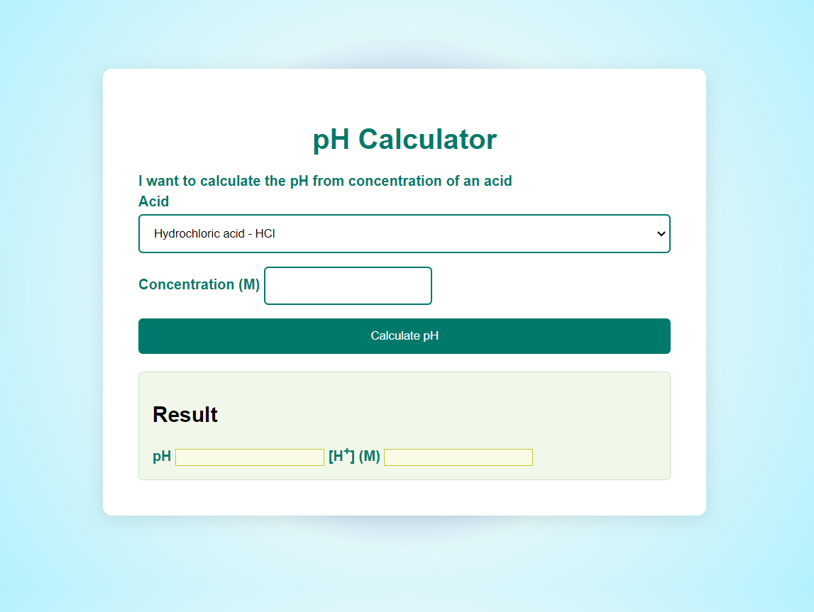

# 
pH Calculator

## Description :-
In pH calculator, you can determine the pH of a solution in a few ways. It can convert pH to H+, as well as calculate pH from the ionization constant and concentration.

## Tech Stacks :-

- HTML
- CSS
- JavaScript

## Features :-
With this pH calculator, you can determine the pH of a solution in a few ways. It can convert pH to H+, as well as calculate pH from the ionization constant and concentration. The pH value is an essential factor in chemistry, medicine, and daily life.
## Screenshots :-

 