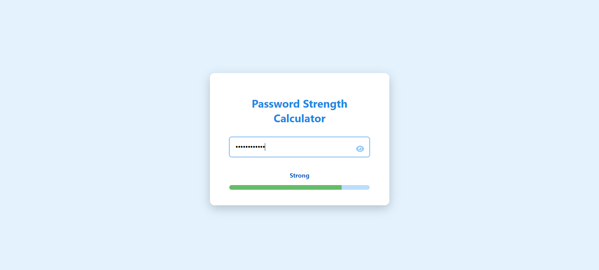

# Password Strength Calculator

This is a simple and attractive Password Strength Calculator built with HTML, CSS, and JavaScript. The application checks the strength of a user's password and provides visual feedback through a dynamically updating strength bar.

## Features

- **Real-time Strength Calculation:** The password strength is calculated in real-time as the user types.
- **Dynamic Strength Bar:** A visual strength bar updates dynamically to reflect the strength of the entered password.
- **Password Toggle Visibility:** An eye icon allows users to toggle the visibility of their password.
- **Responsive Design:** The application is styled with a blue theme and is responsive to different screen sizes.

## Technologies Used

- **HTML**
- **CSS**
- **JavaScript**

## Setup and Usage

1. **Clone the repository:**
    ```bash
    git clone https://github.com/yourusername/password-strength-calculator.git
    ```

2. **Navigate to the project directory:**
    ```bash
    cd password-strength-calculator
    ```

3. **Open `index.html` in your web browser:**
    ```bash
    open index.html
    ```

## File Structure

- `index.html`: The main HTML file that contains the structure of the application.
- `styles.css`: The CSS file that contains the styles for the application.
- `script.js`: The JavaScript file that contains the logic for password strength calculation and dynamic updates.

## How It Works

- **Password Strength Calculation:** The strength of the password is calculated based on the following criteria:
  - Length of the password (minimum 8 characters).
  - Presence of lowercase letters.
  - Presence of uppercase letters.
  - Presence of digits.
  - Presence of special characters.

- **Strength Levels:**
  - **Very Weak:** 0-1 criteria met.
  - **Weak:** 2 criteria met.
  - **Medium:** 3 criteria met.
  - **Strong:** 4 criteria met.
  - **Very Strong:** All 5 criteria met.

- **Dynamic Updates:** The strength message and bar width update dynamically as the user types or erases the password.

## Customization

You can easily customize the strength criteria or the styles by modifying the `script.js` and `styles.css` files respectively.

## Screenshots



