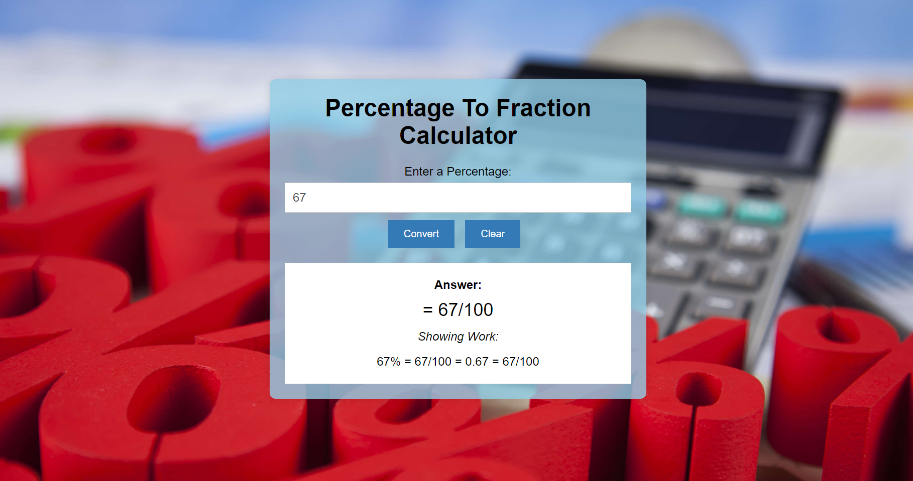

# Percentage Fraction Calculator

 This is a simple online calculator converts a percent to a fraction and vice-versa

## Features

- Converts Percent to Fraction or Fraction to Percent.
- It also provide detail solution
- You can reset the calculation to starting

## Example

For example, to calculate the fraction of percentage 62.5%:
- Enter 62.5
- Click "Convert" to see the result.

## Tech Stack

- HTML
- CSS
- JavaScript

## Screenshots

