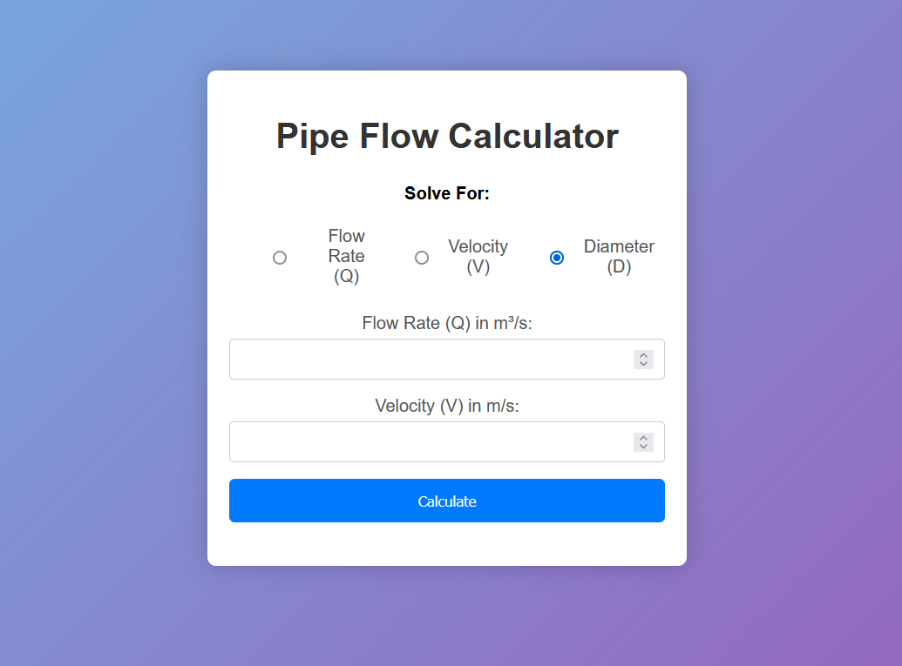

# Pipr Flow Calculator

Welcome to the Pipr Flow Calculator! This tool allows you to calculate the flow rate of a fluid through a pipe using various parameters. Whether you are an engineer, plumber, or simply curious about fluid dynamics, this calculator will help you determine the flow rate with ease.

# Technologies Used

- HTML
- CSS
- JavaScript

# Screenshots

