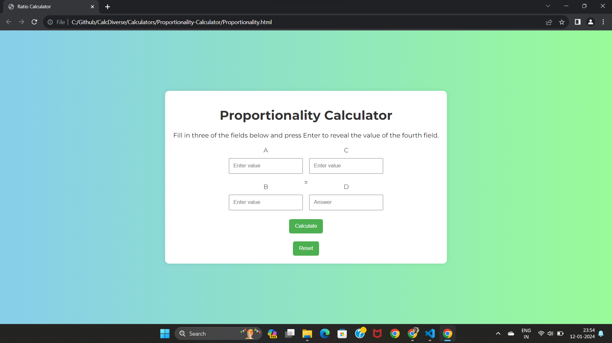

# 
Proportionality Calculator

## Description:

The Proportionality Calculator is a web-based tool designed to calculate proportions between four values. It provides a simple and user-friendly interface to input values for A, B, C, and D and instantly calculates the proportional relationship between them.

## Features:

- Calculate proportions between A, B, C, and D.
- User-friendly web interface.
- Real-time calculation with instant results.

## Tech Stacks:

- HTML
- CSS
- JavaScript

## Screenshots:

## How to Use:

1. Enter values for A, B, C, and D in the respective input fields.
2. Press Enter or click the "Calculate" button to calculate the proportions.
3. View the results in the designated output area.

