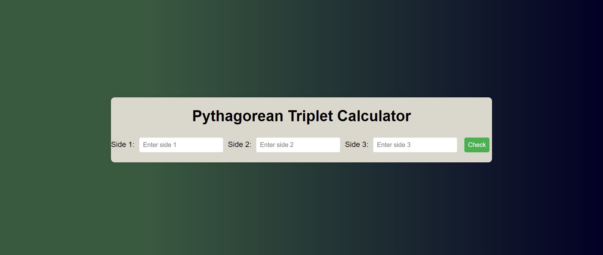

# 
Pythagorean Triples Calculator

## Description :-

The Pythagorean Triples calculator is a web-based tool that verifies whether user-inputted side lengths form a Pythagorean triplet or not, displaying the result dynamically on the webpage.

## Tech Stacks :-

- HTML
- CSS
- JavaScript

## Screenshots :-
