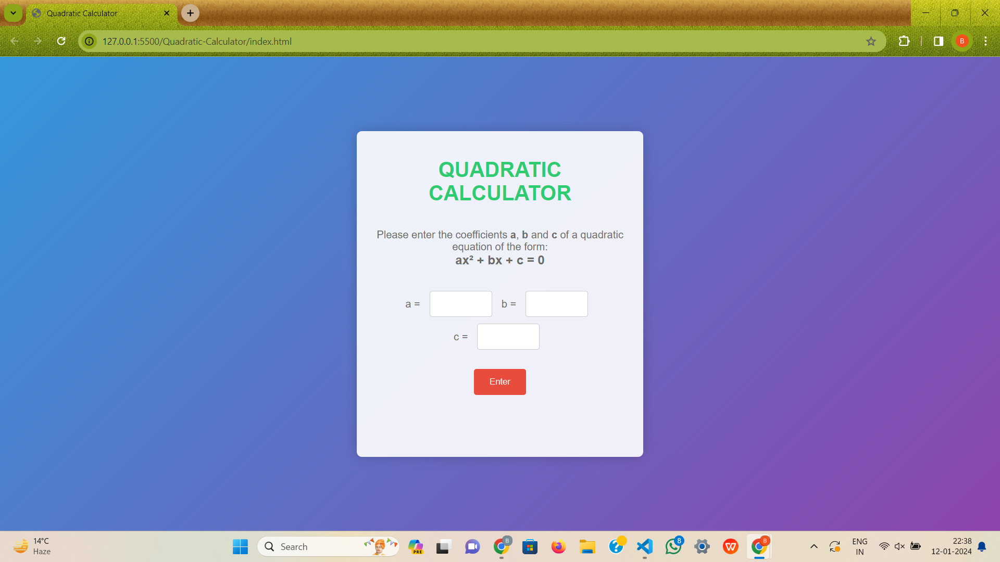
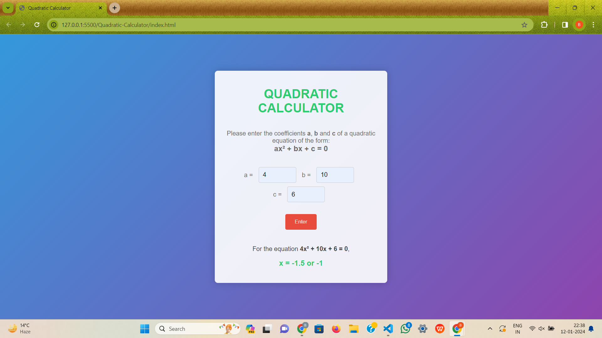

# 
Quadratic Calculator

## Description :-

Quadratic Calculator take the values of co-efficients of the variable and calculates the two roota of the quadratic equation. 

## Tech Stacks:-

- HTML
- CSS
- JavaScript

## Screenshots/ GIFs:-

