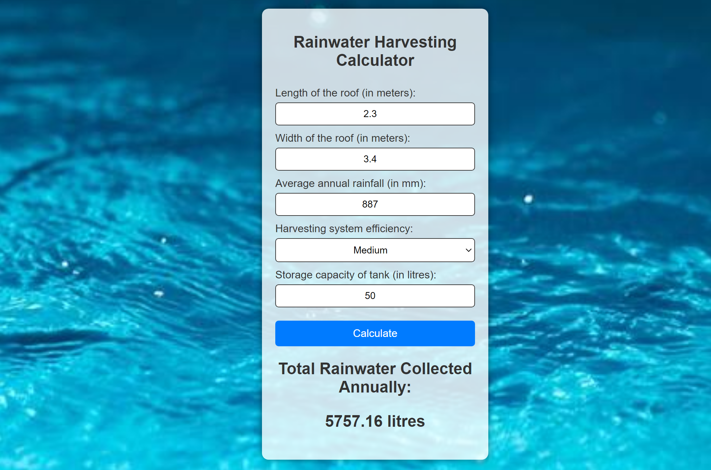

# 
Rainwater Harvesting Calculator

## Description :-

The Rainwater Harvesting Calculator is a web based application that calculates the average annual rainwater that the harvesting tank can store (in litres) based on inputs fields such as:-
 - height of the roof (in metres)
 - width of the roof (in metres)
 - Average annual rainfall (in mm) in the region
 - Harvesting system efficiency (high , low ,medium)
 - Storage capacity of tank (in litres).

## Tech Stacks :-

- HTML
- CSS
- JavaScript

## Working :-

-  The working is based on below formulas :-
   1) area = length * width
   2) totalRainwater = area * (rainfall / 1000) * efficiency * 1000

## Screenshots :-

