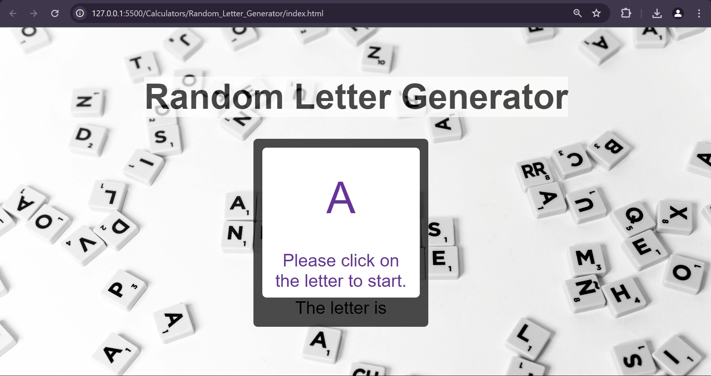
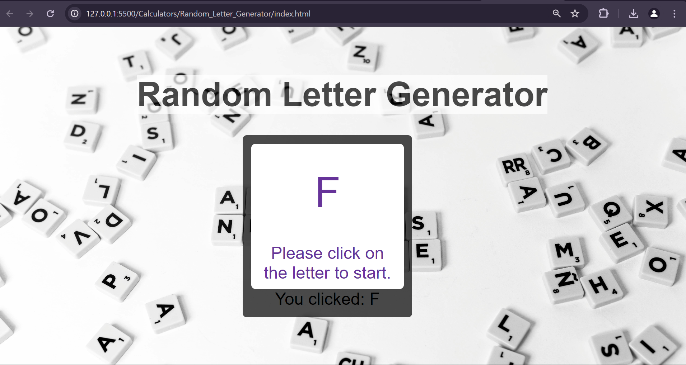

# 
Random Letter Generator

## Description :-
* The Random Letter Generator game is a simple and interactive web-based application that provides users with an entertaining way to test their reflexes and vocabulary. 
* The game presents users with a constantly changing random letter from the English alphabet and challenges them to click on the displayed letter as quickly as possible.

## Tech Stacks :-

- HTML
- CSS
- JavaScript

## Features :-
* Random Letter Generation: The game dynamically generates random letters from the English alphabet and displays them to the user.

* Interactive Interface: Users can interact with the game by clicking on the displayed letter.

* Visual Feedback: The game provides visual feedback to users, highlighting the clicked letter

* Responsive Design: The game is designed to be responsive, ensuring it works well on various devices and screen sizes.
### It can be used in 
* Educational Activities: Teachers and educators can use random letters to create spelling tests, phonics exercises, or to assist in teaching letter recognition and literacy skills to young students.
* Brain Teasers and Learning Games: Creating quizzes, puzzles, or educational games that require letter identification or unscrambling is another application, beneficial for both classroom and recreational use.

## Screenshots :-

