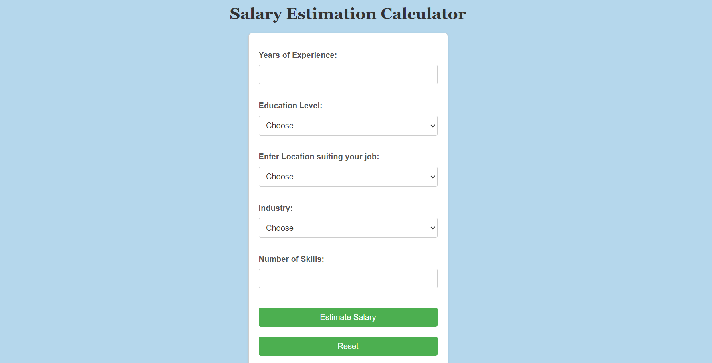

# 
Salary Estimation Calculator

## Description :-

This calculator estimates a user's salary based on several key factors. It provides the output based on the variables entered by the user. 

## Tech Stacks :-
- HTML
- CSS
- JavaScript

## How To Use :-
- Add your Years of Experience, Education Level, Location, industry and no.of skills
- Then click estimate salary

## result :- 
will display each increase in amount based on the user's input

## Screenshots :-

