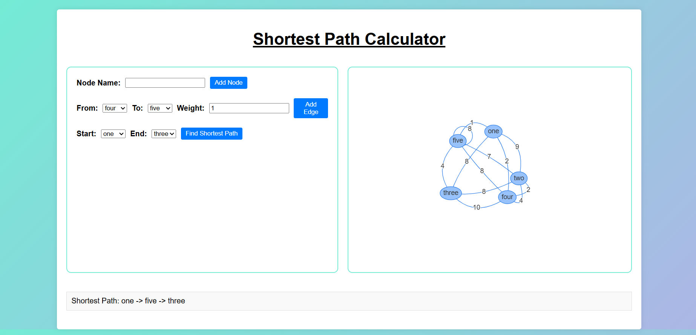

# 
Shortest Path Calculator

## Description :-

It is a simple calculator which calculates the shortest path between two points. It uses the `Dijkstra's Algorithm` to calculate the shortest path. You can add the nodes and edges between them and then calculate the shortest path between them. You can make your own graph and calculate the shortest path between any two nodes.

## Tech Stacks :-

- HTML
- CSS
- JavaScript

## Screenshots :-

