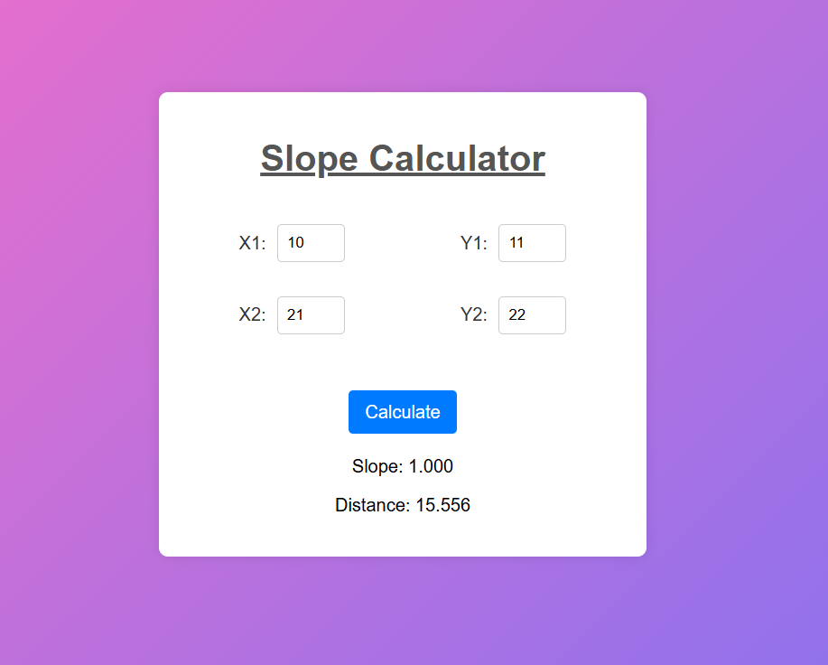

# 
Slope Calculator

## Description :-

In this calculator we can calculate the slope of the line. If two points (in form of x and y coordinates) are given we can calculate the distance between the two points with their slope.

## Tech Stacks :-

- HTML
- CSS
- JavaScript

## Features :-

- It can calculate the slope of the line.
- It can calculate the distance between two points.

## How to Use :-

1. Open the `index.html` file in your web browser.
2. Input the required values in the respective field.
3. Click the "Calculate" button to get the result.

## Screenshots:-

