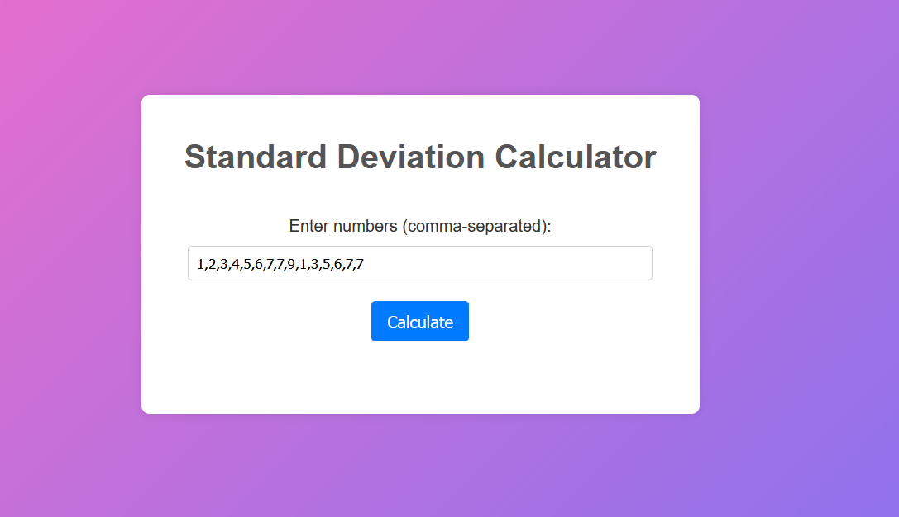

# 
Standard Deviation Calculator

This web application calculates the standard deviation of a set of comma-separated values.

## Usage

1. Enter the values in the input field, separated by commas.
2. Click the "Calculate" button to calculate the standard deviation.
3. The result will be displayed below the input field.

## Example

Input: 1,2,3,4,5,6,7,7,9,1,3,5,6,7,7

Output: The standard deviation is 2.363

## Technologies Used

- HTML
- CSS
- JavaScript

## Screenshot

